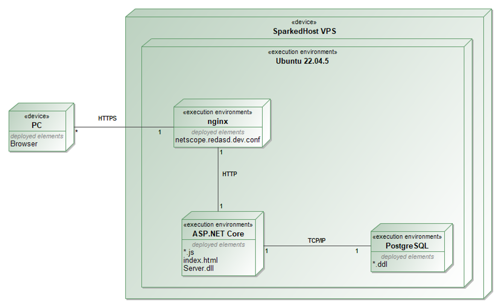

# NetScope

## 1. Sprendžiamo uždavinio aprašymas

### 1.1. Sistemos paskirtis

NetScope skirta tinklo infrastruktūrai registruoti, tvarkyti ir stebėti vienoje vietoje. Duomenys sudaro hierarchiją: **vieta → tinklo įrenginys →  klientas**. Vieta gali būti pastatas, patalpa ar kita fizinė arba loginė tinklo sritis; įrenginys – maršrutizatorius, komutatorius, prieigos taškas ir pan.; klientas – kompiuteris, telefonas, planšetė ar kitas įrenginys. Sistema leidžia šiuos objektus peržiūrėti, filtruoti, kurti, redaguoti ir šalinti pagal naudotojo teises.

### 1.2. Funkciniai reikalavimai

| Rolė | Funkcijos |
| --- | --- |
| **Svečias** | Užsiregistruoja ir prisijungia. |
| **Naudotojas** | Atsijungia; peržiūri ir filtruoja vietas bei vietų įrenginius; atidaro jų detales; kuria vietas; redaguoja ir šalina savo vietas bei jų įrenginius; savo vietose peržiūri ir šalina prie įrenginių prijungtus klientus. |
| **Administratorius** | Valdo vietas, įrenginius ir klientus nepriklausomai nuo vietos savininko; peržiūri ir šalina naudotojus. |

## 2. Sistemos architektūra



## 3. Naudotojo sąsaja

Wireframes ir Screenshot'ai


## 4. API specifikacija

Pilnos užklausų ir atsakymų schemos su kiekvieno metodo pavyzdžiais pateiktos [OpenAPI specifikacijoje](api-spec.yaml).

| Nr. | Metodas | Kelias | Sėkmės kodas |
| --- | --- | --- | --- |
| 1 | GET | `/api/locations` | 200 |
| 2 | GET | `/api/locations/{locationId}` | 200 |
| 3 | POST | `/api/locations` | 201 |
| 4 | PUT | `/api/locations/{locationId}` | 200 |
| 5 | DELETE | `/api/locations/{locationId}` | 204 |
| 6 | GET | `/api/locations/{locationId}/devices` | 200 |
| 7 | GET | `/api/locations/{locationId}/devices/{deviceId}` | 200 |
| 8 | POST | `/api/locations/{locationId}/devices` | 201 |
| 9 | PUT | `/api/locations/{locationId}/devices/{deviceId}` | 200 |
| 10 | DELETE | `/api/locations/{locationId}/devices/{deviceId}` | 204 |
| 11 | GET | `/api/locations/{locationId}/devices/{deviceId}/clients` | 200 |
| 12 | GET | `/api/locations/{locationId}/devices/{deviceId}/clients/{clientId}` | 200 |
| 13 | POST | `/api/locations/{locationId}/devices/{deviceId}/clients` | 201 |
| 14 | PUT | `/api/locations/{locationId}/devices/{deviceId}/clients/{clientId}` | 200 |
| 15 | DELETE | `/api/locations/{locationId}/devices/{deviceId}/clients/{clientId}` | 204 |

Papildomi metodai:

| Metodas | Kelias | Paskirtis | Kodas |
| --- | --- | --- | --- |
| POST | `/api/auth/register` | Registracija, suteikiama User rolė ir JWT | 201 |
| POST | `/api/auth/login` | Prisijungimas, JWT | 200 |
| GET | `/api/auth/me` | Dabartinė paskyra | 200 |
| POST | `/api/auth/refresh` | Refresh žetono rotacija ir naujas JWT | 200 |
| POST | `/api/auth/logout` | JWT ir refresh žetono atšaukimas | 204 |
| GET | `/api/overview` | Vietų ir įrenginių sudėtinė suvestinė | 200 |
| GET | `/api/users` | Administratoriaus naudotojų sąrašas | 200 |
| DELETE | `/api/users/{userId}` | Administratoriaus atliekamas naudotojo šalinimas | 204 |
| GET | `/health` | API ir DB pasiekiamumas | 200 / 503 |

### Užklausų pavyzdžiai

Prisijungimas ar registracija:

```json
{"email":"redas@netscope.local","password":"NetScopeDemo!2026"}
```

Vietos POST / PUT:

```json
{"name":"301 laboratorija","address":"Studentų g. 50, Kaunas","description":"Mokomasis tinklas"}
```

Įrenginio POST / PUT:

```json
{"name":"Pagrindinis maršrutizatorius","type":"Router","ipAddress":"192.168.10.1","macAddress":"02:00:00:10:00:01","status":"Online"}
```

Kliento POST / PUT:

```json
{"name":"Darbo vieta 01","type":"Computer","ipAddress":"192.168.10.10","macAddress":"02:00:00:10:01:01"}
```

Įrenginių tipai: `Router`, `Switch`, `AccessPoint`, `Firewall`, `Other`. Būsenos: `Online`, `Offline`, `Maintenance`. Klientų tipai: `Computer`, `Phone`, `Tablet`, `Printer`, `Other`.

MAC adresai normalizuojami į didžiąsias raides; įrenginio MAC unikalus vietoje, kliento MAC unikalus įrenginyje. IP gali būti IPv4 arba IPv6.

### Filtravimas ir puslapiavimas

Visi sąrašai priima `search`, `page` (nuo 1) ir `pageSize` (1–100, numatyta 20). Atsakymo forma:

```json
{"items":[],"total":0,"page":1,"pageSize":20,"links":{"self":{"href":"/api/locations?page=1&pageSize=20","method":"GET"}}}
```

Vietas papildomai galima filtruoti `ownerId`, įrenginius – `type` ir `status`, klientus – `type`. Pavyzdys: `/api/locations/{locationId}/devices?type=Router&status=Online&search=laboratorija&page=1&pageSize=10`. Naudotojų paieška vykdoma pagal el. paštą.

## 5. Projekto išvados

1. Sukurta vietų, tinklo įrenginių ir klientų valdymo sistema su aiškia duomenų hierarchija ir 15 pagrindinių CRUD metodų.
2. React sąsaja ir ASP.NET Core API leidžia registruoti, rasti ir tvarkyti infrastruktūros objektus.
3. Implementuota JWT autentifikacija leidžia riboti tam tikras sistemos funkcijas pagal naudotojo rolę.

## Demonstraciniai duomenys

| El. paštas | Rolė | Slaptažodis |
| --- | --- | --- |
| `admin@netscope.local` | Admin | `NetScopeDemo!2026` |
| `redas@netscope.local` | User | `NetScopeDemo!2026` |
| `ieva@netscope.local` | User | `NetScopeDemo!2026` |